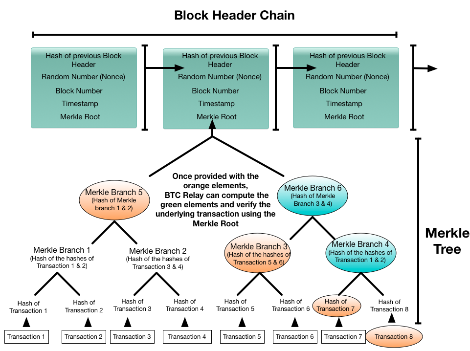

# BTCRelay
## 1. BTC Relay 简介
2016年5月2日 ConsenSys 团队宣布正式推出 BTCRelay，此项目被认为是第一个侧链项目，其中比特币为主链，以太坊为侧链。从技术的角度上讲，BTC Relay 是以太坊上的一个智能合约，它使用 Serpent 语言实现了BTC的 SPV 功能。通过以太坊的智能合约功能验证比特币网络上的交易。把以太坊网络与比特币网络以一种安全、去中心化的方式连接起来。

BTCRelay 背后的思想是在比特币和以太坊节点之间建立一种信任机制，如果一笔比特币交易发送给以太坊的一个全节点，它能够识别、验证这笔交易，而且根据预先的设定调用相关的智能合约。

在此之前，以太坊的节点只能验证以太坊的交易请求，比特币的节点也只能验证比特币的交易请求。这两个不同的区块链系统之间没有一种可信的通信机制。这种限制的根源在于：
一个节点要验证一笔交易，必须依赖账本的历史数据，否则无法判断该交易是否被确认。区块链本质上是一个分布式账本，通过p2p通信机制，在每一个全节点上有一个全量账本数据的副本。每一个节点在本地拥有足够的历史数据验证链内的交易，但是无法验证链外的交易。比如对于一个以太坊的节点来讲，它自身没有比特币的区块数据，即使能够接受比特币的交易，也无法验证其正确性。

如果有一种信任机制能令以太坊能够验证比特币的交易数据，进而可以触发以太坊上的智能合约。Dapp开发者可以在客户端设置一个“比特币支付”按钮，让比特币的持有者也能直接使用基于以太坊的Dapp，不需要将比特币兑换为以太币。
一个潜在的应用场景是使用比特币购买加密猫。加密猫是以太坊上的 ERC721 token，只能通过以太币购买。



 待售加密猫：0.1523ETH 


通过BTCRelay，加密猫的商家也可以接受比特币支付。具体的业务流程如下：

1. 买家从Dapp网站上，选定加密猫，获取商家比特币地址，价格等信息。
2. 买家向商家的地址支付指定的比特币，并且在转账交易中附加额外的信息：买家的以太坊地址，商品ID等信息。
3. 系统监控商家的比特币地址，收到比特币支付消息之后，生成相应的SPV证明，与交易信息合并发送给BTCRelay智能合约。
4. BTCRelay 验证此交易是否被打包，如果验证成功转发给加密猫智能合约。
5. 加密猫智能合约从支付消息中提取转账额、加密猫ID、和买家的以太坊地址等数据，确认商品状态信息之后，将数字资产转移到买家地址上。

流程示意图：使用比特币购买加密猫 

## 2. BTCRelay 设计结构

### 链间交易的验证的本质是建立预言机(Oracle)机制
从本质上讲，验证链外交易是要建立一个预言机机制，从链外第三方获取相关信息，使得智能合约能够验证链外交易。一般来讲，有两种设计方案：

1. 让链外第三方验证人组负责验证交易，每一个验证人独立的验证交易，如果通过就附加上自己的签名发给智能合约。智能合约通过收集验证签名，判断交易是否获取了足够多验证人的认可。如果是，那么就认为此交易是正确的。

	这个方案的优点是简单、通用，适用于很多场景。但是缺点是验证人作弊的成本比较低。所以验证人组的人数不能太少，否则验证人就会比较容易串通；但是也不能太大，否则管理成本和运算成本就会过高。
	
2. 让链外第三方验证人输入比特币的每一个区块头数据，智能合约利用SPV原理验证每一笔比特币交易。

	这个方案验证人的作弊成本比较高，因为每个区块头包含POW，验证人如果要篡改一个区块头，必须要组织算力重新挖矿，才能提交符合难度系数的区块头；而诚实的验证人不需要任何算力去挖矿，只需要通过p2p网络同步最新的区块即可。但是这个方案也有缺点：智能合约需要管理和存储所有区块头数据。

对于比特币来讲，存储的成本大约是每年新增4.2M字节（每个比特币区块头80字节，平均每10分钟一个区块）。存储成本还是可以接受的，所以 BTCRelay 选择了第二种解决方案。

### 架构是什么？什么是SPV？什么是Relayer？

基本组件：

2. Relayer，
1. 区块头存储与管理
3. SPV Proof Generator
4. SPV Verifier

BTCRelay 架构示意图 

跨链交易验证的问题本质上是一个预言机问题，对于BTCRelay来讲，其核心就是建立一种机制获得比特币的相关数据，使得它能够验证任何一笔已经被比特币矿工确认的比特币交易。

- Relayer
BTC Relay依赖于一组叫做Relayers的社区成员，他们通过运行一个软件从比特币网络区块向BTC Relay平台传输数据。以太坊去中心化应用程序（Dapps）然后可以查询Relay的智能合约来核查比特币网络上的活动。

比特币和以太坊之间的交易价值仍然需要第三方中介，这些分散技术试图取代它。BTC Relay用信任最小化的智能合约取代第三方。这加深了区块链空间的两个主要元素的互连，使我们更接近统一的全球价值转移网络。

- 区块头验证和存储

- SPV Proof 生成

- SPV Proof 验证

- 

## 3. 详细技术分析，源代码分析

从技术的角度来讲，BTCRelay 的主要功能包括：

1. 验证一个已经被确认的比特币转账交易
2. (可选)将已经验证的比特币交易转发给其它智能合约
3. 存储比特币的区块头
4. 检查智能合约内部最新的Bitcoin区块信息

BTCRelay 智能合约的详细的ABI接口信息请参考：http://btcrelay.surge.sh/BitcoinRelayABI.js。这里只介绍关键的几个接口函数

- verifyTx(rawTransaction, transactionIndex, merkleSibling, blockHash)

	验证指定的比特币交易是否被主链上的区块确认，而且确认数至少是6.

	输入参数为比特币交易，及其SPV Proof相关数据

	- rawTransaction - 比特币交易的二进制字节数组表示
	- blockHash - 此交易所属区块的hash值
	- transactionIndex - 此交易在所属区块的索引值
	- merkleSibling - hash数组，用于重新计算Merkle Root

	返回值：
	
	- 如果交易验证失败，则返回 0；
	- 如果交易验证成功，则返回交易的hash值

- relayTx(rawTransaction, transactionIndex, merkleSibling, blockHash, contractAddress)

	通过调用 verifyTx() 验证比特币交易的正确性，如果验证通过，把交易转发给指定的目标合约地址。目标合约必须实现 processTransaction(bytes rawTransaction, uint256 transactionHash) returns (int256) 函数。
	
	输入参数为比特币交易，SPV Proof相关数据，以及目标智能合约的地址。

	- rawTransaction - 比特币交易的二进制字节数组表示
	- blockHash - 此交易所属区块的hash值
	- transactionIndex - 此交易在所属区块的索引值
	- merkleSibling - hash数组，用于重新计算Merkle Root

	返回值：
	
	- 如果交易验证失败，则返回错误码 ERR_RELAY_VERIFY；
	- 如果交易验证成功，则返回目标智能合约 processTransaction() 函数的返回值。

- storeBlockHeader(blockHeader)

	验证并且保存新的比特币区块头, 验证条件包括：是否符合难度系数，前一个区块是否已经存在.

	输入参数：

	- blockHeader - 比特币区块头的二进制字节数组表示.

	返回值：
	
	- 如果交易验证失败，则返回 0；
	- 如果交易验证成功，则返回此区块的高度。

- getBlockHash(blockHeight)

	根据指定的区块高度，返回区块头hash
	
- getBlockHeader(blockHash)

	根据指定的区块头hash，返回区块头数据

- getBlockchainHead(), getLastBlockHeight(), others

# 总结，在整个的侧链和跨链背景下，定位和价值是什么？如何评价？有什么借鉴和参考价值？有什么关联项目？需要注意的问题？相关的性能指标？优劣势总结

BTCRelay 并不是一个完整的侧链项目，它并没有实现资产的双向锚定，它本身并不支持比特币资产转移到以太坊网络上，这个任务有RootStock 完成。但是它完成了侧链的第一个步骤：侧链验证主链的交易功能。

这种方法可以扩展到其它区块链项目上，比如比特币和EOS之间，

它的限制：

- 存储限制，主链区块头的数据量比较小
- 延时问题，最终确定性

BTC Relay采用了智能合约内嵌Bitcoin SPV的原理来允许以太用户可以用Bitcoin进行交易的目的，合约里面存储了另一个“小型的Bitcoin区块链”，因此也称为以太坊的一条侧链。从BTC Relay的官网以及github互动来看，这个项目应该已经有比较长的时间没有更新了，总体开看，这个项目不同于其他利用类似双向锚定原理的侧链，直接利用以太坊的智能合约实现，原理上比较容易理解，但个人认为其存在以下几个问题：

依靠社区成员Relayers来维护这个合约的成本较高（手续费太高）
社区成员Relayers活跃度太低，从其mainnet来看，现在只有单一的Relayers
内部智能合约体积膨胀问题

# 开放式思考
1. 如何建立一种信任机制，让比特币节点验证以太坊的交易，或者智能合约的状态更新？
2. 如果要建立一种信任机制，让以太坊识别EOS的交易，还能用 BTCRelay 这种方案吗？
3. 如果要建立一种信任机制，让以太坊识别传统金融机构的交易(比如银行转账，股票交易等)，有什么解决方案？
4. 假如你是一个程序员，请尝试写一个程序生成指定比特币交易的SPV Proof，并且验证SPV Proof的正确性。
5. 尝试写一个使用比特币众筹的Dapp。

# 参考文献列表

- [Enabling Blockchain Innovations with Pegged Sidechains](https://blockstream.com/sidechains.pdf)

- [BTC Relay Is Live](https://consensys.net/static/BTCrelay.pdf)

BTC Relay是一个开源项目，支持基于以太坊的网络以编程方式与比特币网络以及最终其他以太坊进行互操作和基于比特币的系统。 BTC Relay是一个完全分散的智能合约不向任何一方授予特权的社区。

此外，BTC Relay已被添加到 EtherEx ，一个分散的交易所，作为一个比特币可以与以太网交换的机制，没有任何对手方 风险。 

另一个潜在的用例是发布基于以太坊的“BTC”令牌 （ETHBTC）基于在比特币协议上的多重锁定中锁定实际BTC令牌。 这个 计划在BTC和ETHBTC之间建立双向桥梁。 

从技术角度来看， BTC Relay实施比特币SPV（简化支付验证）验证比特币交易是否已经确认（足够）比特币区块链。 

社区成员称为中继，提供BTC中继由比特币矿工生成的新比特币块头。 

复仇 分散的应用程序开发人员可以从他们的智能API调用BTC Relay 合同以验证比特币网络上的活动。 任何人都可以加入以太坊网络并成为继承人; 没有重型硬件或电力消耗比特币采矿所需的。 

BTC Relay是在以太坊基金会下构思和资助的 当BTC的开发人员Joseph Chow采纳并得到ConsenSys的支持，加入ConsenSys。 

万向区块链实验室的拨款用于资助 独立的安全审计和奖励富有成效的bug赏金计划。 “BTC继电器是一个构建模块，我期待着基础设施，应用程序和 BTC Relay帮助实现以太坊平台的创新。 该 可能性令人兴奋，“BTC继电器开发人员Joseph Chow说

以太坊的发明者Vitalik Buterin说：“我很高兴看到BTC继电器提供 这种跨区块链通信的首次生产发布，并希望 它将为跨区块链应用程序的互操作设置一个示例 比特币和以太坊之间，其他区块链和以太坊以及公共和 私人或财团连锁店，未来很多年。“ 

# Trust pegging of BTC in Ethereum - 双向挂钩
https://medium.com/@ConsenSys/taking-stock-bitcoin-and-ethereum-4382f0a2f17

# Backup
ConsenSys的创始人兼首席执行官Joseph Lubin表示，“BTCRelay是一个强大的使以太坊智能合约能够作为各种其他SPV钱包的工具。基于以太坊的网络或其他基于区块链的系统（比特币，Doge等）私有权限或开放的无权限实现。有了这个能力，以太坊，由于其EVM和智能合约的状态，计算能力功能，可以作为许多胶水协议的基础，将加入各种各样的胶水协议区块链网络和其他分散的服务一起进入互联网分散的系统。 我们设想一个由许多专门建造的私营企业组成的世界除了公共区块链网络和BTC之外，还有财团和区块链系统继电器及其扩展可以使它们都能轻松实现互操作。

以太坊联合创始人Vitalik Buterin评价说：

	很高兴能够看到BTC Relay提供了有史以来第一款跨区块链沟通的产品。
	希望其能够成为跨区块链应用程序互操作的榜样，无论是比特币与以太坊之间，
	还是其他区块链与以太坊之间，还是公有，私有或联合链之间的互操作性。

